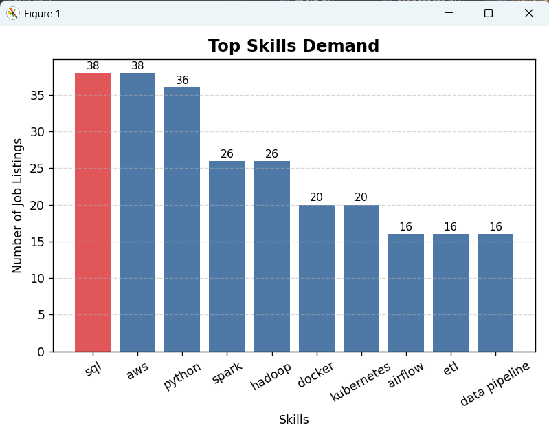

# 🚀 Job Data Pipeline

An end-to-end Data Engineering project that extracts, processes, and analyzes job data.

---

## 📌 Features
- Extract data from API
- Clean and transform data
- Store data in SQLite database
- Perform SQL analysis
- Visualize skill demand using graphs
- Automated pipeline execution

---

## 🛠️ Tech Stack
- Python
- Pandas
- SQLite
- Matplotlib

---

## ⚙️ Project Workflow
Extract → Transform → Load → Analyze → Visualize

---

## 📊 Sample Output
- Python, SQL, AWS are the most in-demand skills

---

## ▶️ How to Run
```bash
python pipeline.py
python visualize.py


## 📂 Project Structure
job-data-pipeline/
│── main.py
│── transform.py
│── load_to_db.py
│── pipeline.py
│── query.py
│── visualize.py
│── jobs_cleaned.csv
│── jobs.db
│── graph.png
│── README.md


## 📈 Visualization




